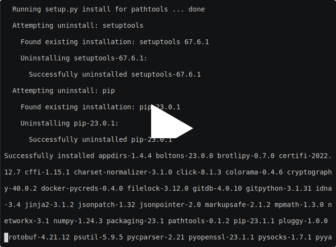

# El programa

# Instalación
Es necesario disponer de una versión de Python>=3.8, a fin de poder instalar Pytorch 2.0.

Crear un entorno virtual y activarlo, ejecutando en una terminal:

	python3 -m venv env
	source env/bin/activate

Clonar el repositorio. Para ello, ejecutar en una terminal

    git clone https://github.com/zanzagaes/GPT-1-Lope

en el directorio donde se quiera copiar el código. Trasladarse a la nueva carpeta creada:

    cd GPT-1-Lope

Instalar las dependencias (idealmente en un entorno nuevo para evitar conflictos)

	pip install -r requirements.txt

# Vídeo de la instalación
	

# Modelo
El modelo usado es una versión sencilla de GPT-1, con los siguientes parámetros:

- Bloques decodificador: 6
- Bloques de atención: 6
- Dimensión de las representaciones: 384
- Tamaño de vocabulario: 81
- Ratio de abandono (*dropout*): 0.2

# Ejecución
El fichero `sample_gpt.py` inicia el modelo, carga los pesos obtenidos del entrenamiento y lo utiliza para generar texto a partir de un texto de estímulo.

Uso del programa:
	
	python3 sample_gpt.py
	
Opciones disponibles:

	usage: Sample GPT [-h] [-p PROMPT] [--temp TEMPERATURE] [-s SAMPLES]
	                  [-t TOKENS] [--seed SEED]
	
	options:
	  -h, --help            show this help message and exit
	  -p PROMPT, --prompt PROMPT
	                        Texto de estímulo del modelo (default: )
	  --temp TEMPERATURE, --temperature TEMPERATURE
	                        Temperatura (default: 0.9)
	  -s SAMPLES, --samples SAMPLES
	                        Número de muestras generadas (default: 5)
	  -t TOKENS, --tokens TOKENS
	                        Símbolos generados por muestra (default: 200)
	  --seed SEED           Semilla del generador de números pseudoaleatorios
	                        (default: None)
	                        
Ejemplo para generar 1 muestra con 200 símbolos:

	python3 sample_gpt.py --samples 1 --tokens 200
	
## Observaciones
Para obtener un comportamiento reproducible hay que fijar la semilla del generardor de números pseudoaleatorios (parámetro `seed`). Por ejemplo:

		python3 sample_gpt.py --samples 1 --tokens 200 --seed 1337
		
Si no se proporciona este parámetro, el generador se inicia con una semilla aleatoria.
